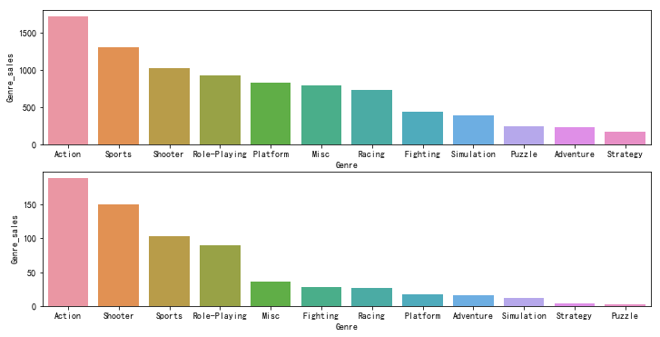
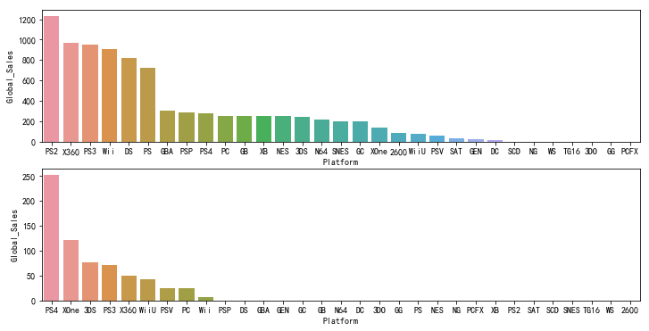
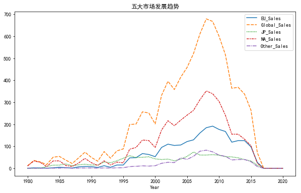
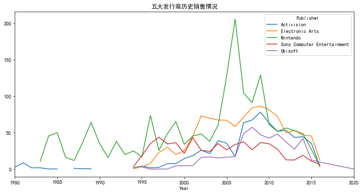

# Video Game Sales 电子游戏销售分析
导入所需要的包


```python
import pandas as pd
import numpy as np 
import matplotlib.pyplot as plt
%matplotlib inline
plt.rcParams['font.sans-serif']=['SimHei'] #用来正常显示中文标签
plt.rcParams['axes.unicode_minus']=False #用来正常显示负号
import seaborn as sns 
import pyecharts
import datetime
from pyecharts.charts import Pie
```

导入数据，给出数据摘要,并检查完整性


```python
df=pd.read_csv('./vgsales.csv')
df.info()
print("缺失数据及个数：\n",df.isnull().sum())
```

    <class 'pandas.core.frame.DataFrame'>
    RangeIndex: 16598 entries, 0 to 16597
    Data columns (total 11 columns):
    Rank            16598 non-null int64
    Name            16598 non-null object
    Platform        16598 non-null object
    Year            16327 non-null float64
    Genre           16598 non-null object
    Publisher       16540 non-null object
    NA_Sales        16598 non-null float64
    EU_Sales        16598 non-null float64
    JP_Sales        16598 non-null float64
    Other_Sales     16598 non-null float64
    Global_Sales    16598 non-null float64
    dtypes: float64(6), int64(1), object(4)
    memory usage: 1.4+ MB
    缺失数据及个数：
     Rank              0
    Name              0
    Platform          0
    Year            271
    Genre             0
    Publisher        58
    NA_Sales          0
    EU_Sales          0
    JP_Sales          0
    Other_Sales       0
    Global_Sales      0
    dtype: int64
    

由于缺失数据不多，所以删除不会影响数据的平衡，在此直接删除有缺失数据的行


```python
df=df.dropna()
df.info()
```

    <class 'pandas.core.frame.DataFrame'>
    Int64Index: 16291 entries, 0 to 16597
    Data columns (total 11 columns):
    Rank            16291 non-null int64
    Name            16291 non-null object
    Platform        16291 non-null object
    Year            16291 non-null float64
    Genre           16291 non-null object
    Publisher       16291 non-null object
    NA_Sales        16291 non-null float64
    EU_Sales        16291 non-null float64
    JP_Sales        16291 non-null float64
    Other_Sales     16291 non-null float64
    Global_Sales    16291 non-null float64
    dtypes: float64(6), int64(1), object(4)
    memory usage: 1.5+ MB
    

## 用户喜好游戏类型


```python
FGE=pd.pivot_table(df,index='Year',columns='Genre',values='Global_Sales',aggfunc=np.sum).sum().sort_values(ascending=False)
FGE=pd.DataFrame(data=FGE,columns={'Genre_sales'})
FGE_near5=pd.pivot_table(df,index='Year',columns='Genre',values='Global_Sales',aggfunc=np.sum).iloc[-5:,:].sum().sort_values(ascending=False)
FGE_near5=pd.DataFrame(data=FGE_near5,columns={'Genre_sales'})
fig,(ax1,ax2)=plt.subplots(2,1,figsize=(12,6))
sns.barplot(x=FGE.index,y='Genre_sales',data=FGE,ax=ax1)
sns.barplot(x=FGE_near5.index,y='Genre_sales',data=FGE_near5,ax=ax2)
```


    <matplotlib.axes._subplots.AxesSubplot at 0x225193f3f98>





动作类游戏一直占据榜首，射击类游戏超过了运动类游戏

## 用户喜欢的游戏平台


```python
FPF=pd.pivot_table(df,index='Year',columns='Platform',values='Global_Sales',aggfunc=np.sum).sum().sort_values(ascending=False)
FPF=pd.DataFrame(data=FPF,columns={'Global_Sales'})
FPF_near5=pd.pivot_table(df,index='Year',columns='Platform',values='Global_Sales',aggfunc=np.sum).iloc[-5:,:].sum().sort_values(ascending=False)
FPF_near5=pd.DataFrame(data=FPF_near5,columns={'Global_Sales'})
fig,(ax1,ax2)=plt.subplots(2,1,figsize=(12,6))
sns.barplot(x=FPF.index,y='Global_Sales',data=FPF,ax=ax1)
sns.barplot(x=FPF_near5.index,y='Global_Sales',data=FPF_near5,ax=ax2)
```


    <matplotlib.axes._subplots.AxesSubplot at 0x225195175f8>





随着时代的变化，最喜欢的平台由PS2变为了PS4，但是X360仍然在占有不少份额

## 游戏市场发展趋势


```python
M=['NA_Sales','EU_Sales','JP_Sales','Other_Sales','Global_Sales']
#绘制各地区销量走势图
df5market_p=pd.pivot_table(df,index='Year',values=M,aggfunc=np.sum)
fig=plt.figure(figsize=(10,6))
sns.lineplot(data=df5market_p)
plt.title('五大市场发展趋势')
```


    Text(0.5, 1.0, '五大市场发展趋势')





# 五大发行商的历史销售情况


```python
P=['Nintendo','Electronic Arts','Activision','Sony Computer Entertainment','Ubisoft']
df5PBL=df[df['Publisher'].isin(P)]
df5PBL_p=pd.pivot_table(data=df5PBL,index='Year',columns='Publisher',values='Global_Sales',aggfunc=np.sum)
df5PBL_p.plot(title='五大发行商历史销售情况',figsize=(12,6))
```


    <matplotlib.axes._subplots.AxesSubplot at 0x225199c3780>





# 五大发行商的市场占额


```python
PBL_near5_5p=df[(df['Year']>2013)&(df['Publisher'].isin(P))]
PBL_near5_5p_G_M_p=pd.pivot_table(data=PBL_near5_5p,index=['Genre','Publisher'],values=M,aggfunc=np.sum)
PBL_near5_5p_G_M_p_pct=PBL_near5_5p_G_M_p.div(PBL_near5_5p_G_M_p.groupby(level=0).sum()).round(2)
PBL_near5_5p_G_M_p_pct=PBL_near5_5p_G_M_p_pct.sort_values(by=['Genre','Global_Sales'],ascending=False)
PBL_near5_5p_G_M_p_pct[:20]
```


<div>
<style scoped>
    .dataframe tbody tr th:only-of-type {
        vertical-align: middle;
    }

    .dataframe tbody tr th {
        vertical-align: top;
    }

    .dataframe thead th {
        text-align: right;
    }
</style>
<table border="1" class="dataframe">
  <thead>
    <tr style="text-align: right;">
      <th></th>
      <th></th>
      <th>EU_Sales</th>
      <th>Global_Sales</th>
      <th>JP_Sales</th>
      <th>NA_Sales</th>
      <th>Other_Sales</th>
    </tr>
    <tr>
      <th>Genre</th>
      <th>Publisher</th>
      <th></th>
      <th></th>
      <th></th>
      <th></th>
      <th></th>
    </tr>
  </thead>
  <tbody>
    <tr>
      <th rowspan="3" valign="top">Strategy</th>
      <th>Activision</th>
      <td>0.45</td>
      <td>0.47</td>
      <td>0.00</td>
      <td>0.56</td>
      <td>0.57</td>
    </tr>
    <tr>
      <th>Ubisoft</th>
      <td>0.47</td>
      <td>0.30</td>
      <td>0.00</td>
      <td>0.06</td>
      <td>0.14</td>
    </tr>
    <tr>
      <th>Nintendo</th>
      <td>0.08</td>
      <td>0.23</td>
      <td>1.00</td>
      <td>0.39</td>
      <td>0.29</td>
    </tr>
    <tr>
      <th rowspan="5" valign="top">Sports</th>
      <th>Electronic Arts</th>
      <td>0.98</td>
      <td>0.95</td>
      <td>0.49</td>
      <td>0.93</td>
      <td>0.96</td>
    </tr>
    <tr>
      <th>Nintendo</th>
      <td>0.01</td>
      <td>0.02</td>
      <td>0.51</td>
      <td>0.02</td>
      <td>0.01</td>
    </tr>
    <tr>
      <th>Sony Computer Entertainment</th>
      <td>0.00</td>
      <td>0.02</td>
      <td>0.00</td>
      <td>0.04</td>
      <td>0.03</td>
    </tr>
    <tr>
      <th>Activision</th>
      <td>0.00</td>
      <td>0.01</td>
      <td>0.00</td>
      <td>0.01</td>
      <td>0.01</td>
    </tr>
    <tr>
      <th>Ubisoft</th>
      <td>0.01</td>
      <td>0.00</td>
      <td>0.00</td>
      <td>0.00</td>
      <td>0.00</td>
    </tr>
    <tr>
      <th rowspan="3" valign="top">Simulation</th>
      <th>Nintendo</th>
      <td>0.38</td>
      <td>0.49</td>
      <td>1.00</td>
      <td>0.27</td>
      <td>0.29</td>
    </tr>
    <tr>
      <th>Electronic Arts</th>
      <td>0.62</td>
      <td>0.47</td>
      <td>0.00</td>
      <td>0.58</td>
      <td>0.67</td>
    </tr>
    <tr>
      <th>Ubisoft</th>
      <td>0.00</td>
      <td>0.04</td>
      <td>0.00</td>
      <td>0.15</td>
      <td>0.04</td>
    </tr>
    <tr>
      <th rowspan="5" valign="top">Shooter</th>
      <th>Activision</th>
      <td>0.52</td>
      <td>0.55</td>
      <td>0.31</td>
      <td>0.60</td>
      <td>0.56</td>
    </tr>
    <tr>
      <th>Electronic Arts</th>
      <td>0.21</td>
      <td>0.21</td>
      <td>0.13</td>
      <td>0.21</td>
      <td>0.19</td>
    </tr>
    <tr>
      <th>Ubisoft</th>
      <td>0.18</td>
      <td>0.15</td>
      <td>0.12</td>
      <td>0.13</td>
      <td>0.15</td>
    </tr>
    <tr>
      <th>Sony Computer Entertainment</th>
      <td>0.06</td>
      <td>0.05</td>
      <td>0.06</td>
      <td>0.04</td>
      <td>0.06</td>
    </tr>
    <tr>
      <th>Nintendo</th>
      <td>0.03</td>
      <td>0.04</td>
      <td>0.38</td>
      <td>0.03</td>
      <td>0.03</td>
    </tr>
    <tr>
      <th rowspan="4" valign="top">Role-Playing</th>
      <th>Nintendo</th>
      <td>0.56</td>
      <td>0.69</td>
      <td>0.94</td>
      <td>0.62</td>
      <td>0.45</td>
    </tr>
    <tr>
      <th>Electronic Arts</th>
      <td>0.20</td>
      <td>0.14</td>
      <td>0.01</td>
      <td>0.19</td>
      <td>0.24</td>
    </tr>
    <tr>
      <th>Activision</th>
      <td>0.13</td>
      <td>0.08</td>
      <td>0.01</td>
      <td>0.09</td>
      <td>0.15</td>
    </tr>
    <tr>
      <th>Ubisoft</th>
      <td>0.09</td>
      <td>0.07</td>
      <td>0.01</td>
      <td>0.09</td>
      <td>0.12</td>
    </tr>
  </tbody>
</table>
</div>


```python

```
